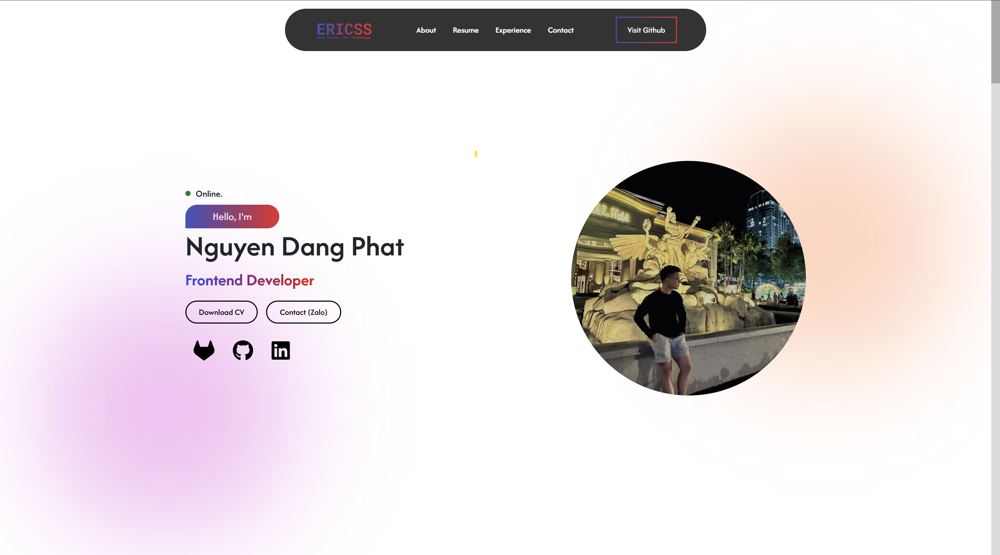

# Portfolio Website - ERICSS



## 📋 Giới thiệu

Đây là website portfolio cá nhân của **Nguyen Dang Phat** - một Frontend Developer với kinh nghiệm 8 tháng phát triển giao diện người dùng. Website được xây dựng hoàn toàn bằng HTML, CSS và JavaScript thuần.

## ✨ Tính năng chính

- 🎨 **Responsive Design** - Tương thích trên mọi thiết bị
- 🌟 **Smooth Animations** - Hiệu ứng mượt mà với AOS (Animate On Scroll)
- 📧 **Contact Form** - Form liên hệ tích hợp EmailJS
- 🎯 **Modern UI/UX** - Giao diện hiện đại, thân thiện người dùng
- 📱 **Mobile Navigation** - Menu responsive cho thiết bị di động

## 🚀 Công nghệ sử dụng

- **HTML5** - Cấu trúc trang web
- **CSS3** - Styling và animations
- **JavaScript** - Tương tác và xử lý form
- **Bootstrap 5.3.3** - Framework CSS responsive
- **Font Awesome Pro** - Icons và biểu tượng
- **AOS Library** - Animation hiệu ứng cuộn trang
- **EmailJS** - Gửi email từ form liên hệ

## 📁 Cấu trúc thư mục

```
├── index.html          # File HTML chính
├── style.css           # CSS styles gốc  
├── style.min.css       # CSS đã minify
├── script.js           # JavaScript functionality
├── Assets/
│   └── bootstrap-5.3.3-dist/  # Bootstrap framework
├── Image/              # Hình ảnh website
├── File/               # Files tài liệu
└── .github/
    └── images/         # Hình ảnh cho README
```

## 🌟 Các section chính

1. **About** - Giới thiệu cá nhân với thông tin liên hệ
2. **Resume** - Kinh nghiệm và kỹ năng chuyên môn
3. **Experience** - Timeline các dự án đã thực hiện
4. **Contact** - Form liên hệ và thông tin social

## 🔧 Cài đặt và chạy

1. Clone repository này:
```bash
git clone https://github.com/nguyenphat006/Project-Portfolio_HTML-CSS-JS.git
```

2. Mở thư mục project:
```bash
cd Project-Portfolio_HTML-CSS-JS
```

3. Mở file `index.html` bằng trình duyệt web hoặc sử dụng Live Server.

## 📞 Liên hệ

- 📧 Email: nguyendangphat1505@gmail.com
- 📱 Phone: +84 379157360
- 🔗 GitHub: [nguyenphat006](https://github.com/nguyenphat006)
- 💼 LinkedIn: [Nguyen Dang Phat](https://www.linkedin.com/in/nguyen-dang-phat-64440829a/)
- 🦊 GitLab: [nguyenphat006](https://gitlab.com/nguyenphat006)

## 📄 License

This project is open source and available under the [MIT License](LICENSE).

---
⭐ Nếu bạn thấy project này hữu ích, hãy cho một star nhé!